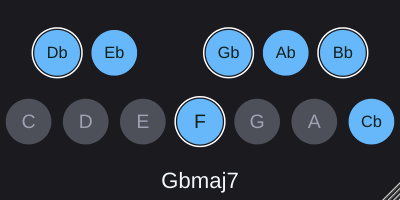

# ScaleView

A small key signature / scale reference as a **VST3**, **Audio Unit** and
**CLAP** plugin. It shows the twelve pitch classes as circles - five on the top row for
the black keys of an octave, seven on the bottom for the white keys - and
lights the notes of the scale you pick.

Note names are spelled for the key rather than always being sharps or flats:
each degree of a seven-note scale takes the next letter of the alphabet and
whatever accidental that letter then needs. C# major reads C# D# E# F# G# A# B#,
while Db major - the same seven notes - reads Db Eb F Gb Ab Bb C.



The plugin does not touch your audio. It passes it through untouched and exists
to be looked at, so it can sit on any track.

This is a port of [ScaleView for REAPER](https://github.com/KallumS/ScaleView-for-Reaper),
a ReaScript. The musical core is the same, verified against it note for note.

## Using it

| Action | Result |
| --- | --- |
| Left-click | Scale list - pick a root under a scale type |
| Right-click | Random Scale, note names on/off, highlight colour |

The window is resizable and keeps its 2:1 proportions. Your selection, colour
and window size are saved with the host project and in presets.

### Scales

Major, Minor (Natural), Harmonic Minor, Ionian, Dorian, Phrygian, Lydian,
Mixolydian, Aeolian, Major Pentatonic, Minor Pentatonic, Major Blues, Minor
Blues, Whole Tone, Diminished Whole-Half and Diminished Half-Whole - each from
18 spelled roots (both spellings of every pitch class, plus Cb), so 288 keys.

## Building

You need [CMake](https://cmake.org) 3.22+ and a C++17 compiler. JUCE is
downloaded automatically by the build, pinned in `CMakeLists.txt`.

### macOS - VST3, Audio Unit and CLAP

Xcode is required (free from the App Store); the command line tools alone are
not enough for the AU.

```sh
cmake -B build -G Xcode
cmake --build build --config Release
```

This produces a universal binary for Intel and Apple silicon:

| Built | Install to |
| --- | --- |
| `build/ScaleView_artefacts/Release/VST3/ScaleView.vst3` | `~/Library/Audio/Plug-Ins/VST3/` |
| `build/ScaleView_artefacts/Release/AU/ScaleView.component` | `~/Library/Audio/Plug-Ins/Components/` |
| `build/ScaleView_artefacts/Release/CLAP/ScaleView.clap` | `~/Library/Audio/Plug-Ins/CLAP/` |

Or set `COPY_PLUGIN_AFTER_BUILD` to `ON` in `CMakeLists.txt` and the build will
install them for you.

Logic and GarageBand only load Audio Units; REAPER and Bitwig will take the
CLAP or the VST3.

macOS will not load an unsigned plugin downloaded from the internet, but one
you built yourself is fine. To validate the AU before opening a host:

```sh
auval -v aufx Scvw Klms
```

Logic and GarageBand only rescan on launch, so quit and reopen them after
installing.

### Windows - VST3 and CLAP

```sh
cmake -B build
cmake --build build --config Release
```

Copy `build\ScaleView_artefacts\Release\VST3\ScaleView.vst3` to
`C:\Program Files\Common Files\VST3\`, and
`...\Release\CLAP\ScaleView.clap` to `C:\Program Files\Common Files\CLAP\`.

### Linux - VST3 and CLAP

Install the JUCE dependencies first:

```sh
sudo apt install libasound2-dev libx11-dev libxext-dev libxinerama-dev \
                 libxrandr-dev libxcursor-dev libfreetype-dev libfontconfig1-dev \
                 libgl1-mesa-dev
cmake -B build -DCMAKE_BUILD_TYPE=Release
cmake --build build
```

Copy the `.vst3` to `~/.vst3/` and the `.clap` to `~/.clap/`.

### A note on CLAP

JUCE does not build CLAP itself, so the plugin is wrapped by
[clap-juce-extensions](https://github.com/free-audio/clap-juce-extensions),
which adds a CLAP target beside the VST3 and AU from the same sources - there
is no separate code for it. It is pinned to a commit rather than the 0.26.0
release, because that release predates JUCE 8.0.12 moving a header into its new
headless module; the pinned commit handles both layouts. Build without it using
`-DSCALEVIEW_BUILD_CLAP=OFF`.

## Tests

`Tests/TestScaleModel.cpp` covers the musical core, and needs neither JUCE nor
a host - it is the same suite the ReaScript has, ported. It checks all 288 root
and scale combinations, that every seven-note scale uses each of the seven
letters exactly once, that enharmonic pairs light the same circles while
reading differently, that the fifteen standard major keys need no double
accidentals, and that Random Scale spreads and never repeats itself.

```sh
cmake -B build-tests -DSCALEVIEW_BUILD_PLUGIN=OFF
cmake --build build-tests
ctest --test-dir build-tests --output-on-failure
```

`-DSCALEVIEW_BUILD_PLUGIN=OFF` skips JUCE entirely, so the tests build in a
couple of seconds with nothing downloaded.

## Layout

| | |
| --- | --- |
| `Source/ScaleModel.h` | The scales, the roots and the spelling engine. No JUCE, no host. |
| `Source/PluginProcessor.*` | Audio passthrough, and the selection, saved with the project |
| `Source/PluginEditor.*` | The icon and its two menus |
| `Tests/TestScaleModel.cpp` | The musical core's tests |

## Differences from the ReaScript

- **No docking.** The host owns the plugin window. It is resizable instead and
  keeps its proportions.
- **Random Scale** is seeded from the system random source rather than
  REAPER's clock.
- **Settings** are saved with the host project and in presets, rather than in
  REAPER's global settings, so two instances can show different keys.
